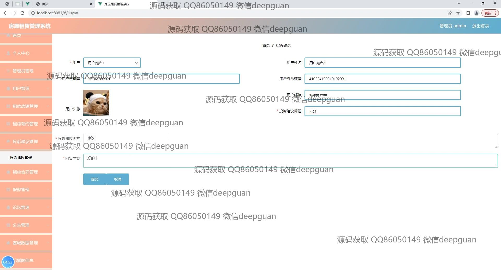

<h1 align="center">房屋租赁管理系统</h1>

## 简介
房屋租赁管理系统：角色分为管理员、用户；具备房源管理、租赁合同管理、公告管理、报修管理、投诉建议反馈等功能，实现全方位的租赁信息和用户服务管理。    --计算机毕业设计源码；毕设源码；java毕业设计源码

## 联系方式

<h3 align="center">获取完整代码与数据库文件 + 微信：deepguan QQ: 86050149 QQ群: 783742310</h3>

<h3 align="center">可帮忙远程部署 包运行成功！提供远程部署、修改代码、设计文档指导、代码讲解等服务！</h3>

## 功能介绍（完整见运行截图）
管理员：管理员可以通过登录界面进入系统，进行用户管理、租房源管理、租房合同管理、报修管理以及公告管理等操作。左侧导航菜单提供了快速访问各个管理模块的功能，管理员可以查看和编辑用户信息，处理租房合同，管理公告和投诉建议，确保系统的良好运行。此外，管理员可以查看并管理房源预约和租赁情况，监控租房论坛中的交流活动，充分实现系统的后台管理功能。

用户：用户通过系统可以注册和登录个人账号，查看房屋租赁资源并进行预约。系统为用户提供租房评价、在线投诉建议和公告查询功能，用户可以在论坛上进行信息交流和互动。用户还可以在个人中心查看和管理个人订单、合同及报修信息，灵活处理各种租赁事务。系统设计简洁明了，满足用户有效获取租赁信息和进行交易操作的需求。

## 运行截图

本代码来源于网络,仅供学习参考使用!

